# Report Rendering Improvement

## Before improvement

### Sort by country and popolation

- **Commit Duration:** 1.9s
- **Render Duration:** 225ms
- **Interactions:** Not recorded (Profiler did not capture explicit interactions, but commit and render times were analyzed instead)
- **Flame Graph:** 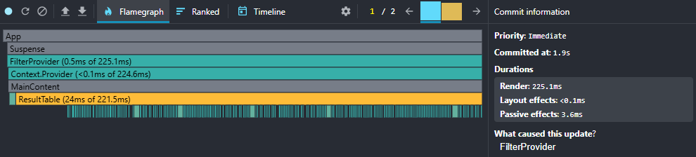
- **Rancker Chart:** 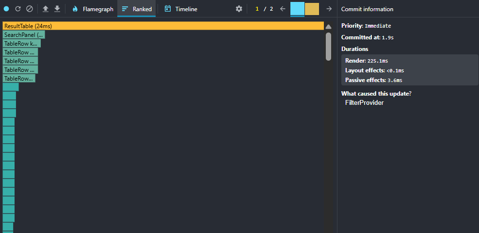

### Add new colmn

- **Commit Duration:** 2.7s
- **Render Duration:** 723 ms
- **Interactions:** Not recorded (Profiler did not capture explicit interactions, but commit and render times were analyzed instead)
- **Flame Graph:** 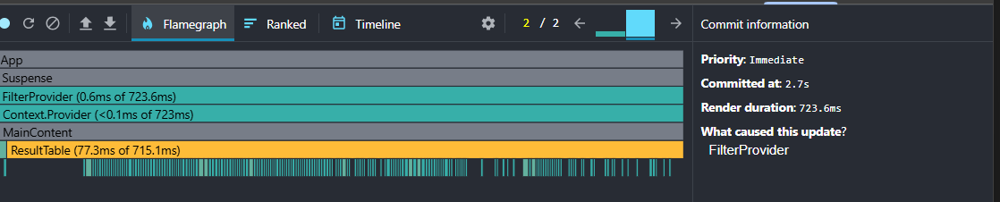
- **Rancker Chart:** 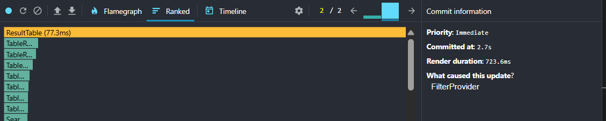

### Search Country

Analiz for first later

- **Commit Duration:** 2.4s
- **Render Duration:** 237.5 ms
- **Interactions:** Not recorded (Profiler did not capture explicit interactions, but commit and render times were analyzed instead)
- **Flame Graph:** 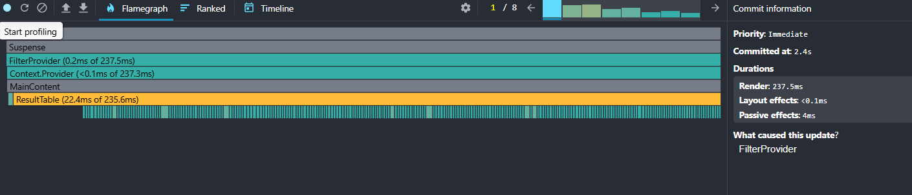
- **Rancker Chart:** 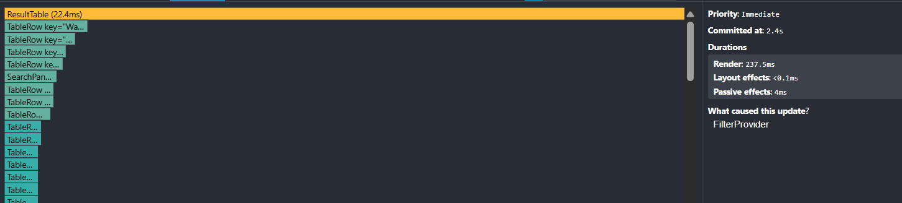

### Select Year

- **Commit Duration:** 4.1s
- **Render Duration:** 237.9 ms
- **Interactions:** Not recorded (Profiler did not capture explicit interactions, but commit and render times were analyzed instead)
- **Flame Graph:** 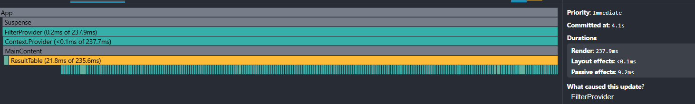
- **Rancker Chart:** 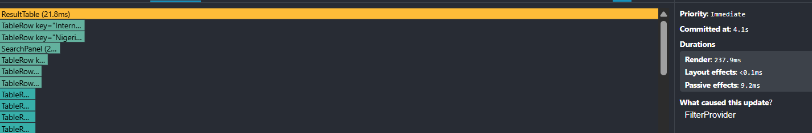

## After improvement

### Sort by country and popolation

- **Commit Duration:** 1.9s
- **Render Duration:** 51.9ms
- **Interactions:** Not recorded (Profiler did not capture explicit interactions, but commit and render times were analyzed instead)
- **Flame Graph:** 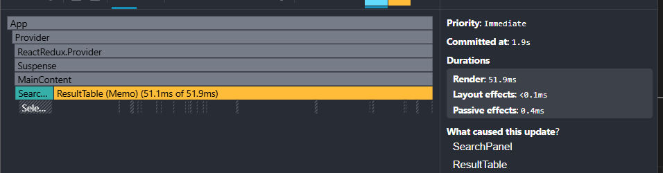
- **Rancker Chart:** 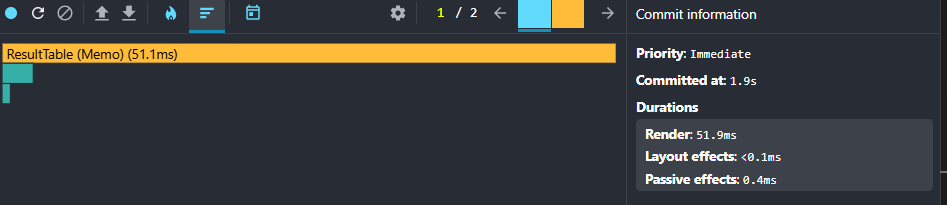

### Add new colmn

- **Commit Duration:** 1.4s
- **Render Duration:** 122 ms
- **Interactions:** Not recorded (Profiler did not capture explicit interactions, but commit and render times were analyzed instead)
- **Flame Graph:** 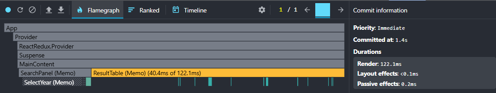
- **Rancker Chart:** 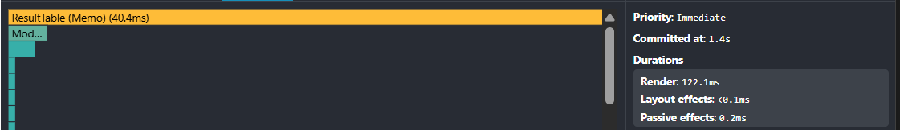

### Search Country

Analiz for first later

- **Commit Duration:** 1.8s
- **Render Duration:** 27.4 ms
- **Interactions:** Not recorded (Profiler did not capture explicit interactions, but commit and render times were analyzed instead)
- **Flame Graph:** 
- **Rancker Chart:** 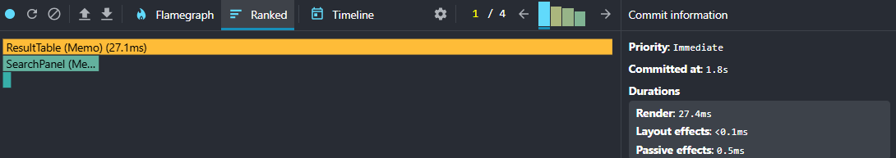

### Select Year

- **Commit Duration:** 2.1s
- **Render Duration:** 307 ms
- **Interactions:** Not recorded (Profiler did not capture explicit interactions, but commit and render times were analyzed instead)
- **Flame Graph:** 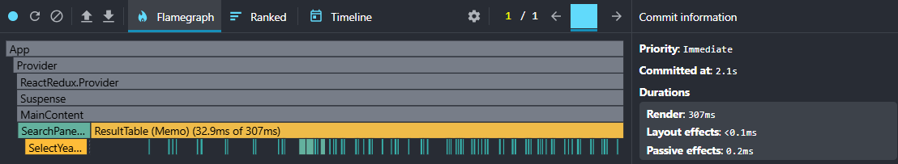
- **Rancker Chart:** 

## Report Rendering Optimization Summary

### Sorting by Country and Population

- **Render Duration:** 225 ms → 51.9 ms
- **Commit Duration:** 1.9s

### Adding a New Column

- **Commit Duration:** 2.7s → 1.4s
- **Render Duration:** 723 ms → 122 ms

### Search by Country

- **Commit Duration:** 2.4s → 1.8s
- **Render Duration:** 237.5 ms → 27.4 ms

### Choice of Year

- **Commit Duration:** 4.1s → 2.1s
- **Render Duration:** 237.9 ms → 307 ms
